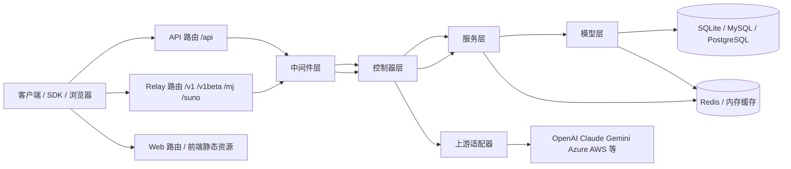
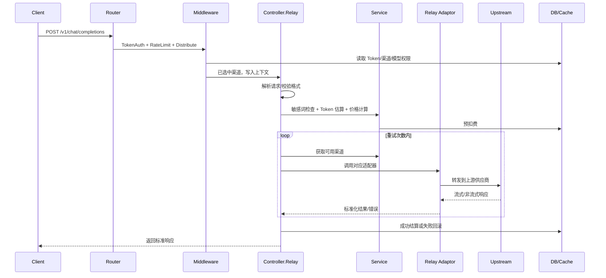

# 架构文档

## 1. 文档目标

本文面向项目维护者与二次开发者，说明 `new-api` 的核心架构、模块边界、关键请求链路、数据与配置流向，以及常见扩展点。本文基于当前仓库代码组织编写，重点描述实际实现，而不是抽象设计图。

## 2. 系统定位

`new-api` 是一个统一 AI 网关与管理平台，核心职责包括：

- 对外提供兼容 OpenAI / Claude / Gemini 等格式的统一 API
- 对内管理多上游渠道、模型映射、用户、令牌、分组、额度与计费
- 提供管理后台、用户控制台、统计看板与运维能力
- 支持文本、图片、音频、嵌入、重排、多媒体任务等多种 AI 能力

系统同时承担两类角色：

- 网关角色：接收客户端请求，选择可用渠道，做格式转换并转发到上游供应商
- 平台角色：管理账号、渠道、价格、限流、支付、订阅、日志、配置与监控

## 3. 总体架构

### 3.1 分层结构

后端总体遵循分层架构：

```text
Router -> Middleware -> Controller -> Service -> Model
                                     -> Relay
```

各层职责如下：

- `router/`
  负责注册 HTTP 路由，区分 API、Relay、Dashboard、Web、Video 等入口。
- `middleware/`
  负责横切逻辑，如鉴权、限流、分发、日志、统计、国际化、缓存、请求体清理。
- `controller/`
  负责协议层与接口层编排，解析请求、组织响应、调用服务层或中继层。
- `service/`
  负责业务规则，如渠道选择、计费预扣、订阅配额重置、敏感词检测、亲和路由等。
- `model/`
  负责数据库模型、缓存装载、数据查询与持久化。
- `relay/`
  负责上游协议适配、请求转换、流式处理、任务型接口对接。

### 3.2 高层组件图



## 4. 启动流程

服务入口在 [main.go](/Users/benjamin/Documents/github/new-api/main.go)。

启动阶段主要完成以下工作：

1. 初始化资源与基础设施
2. 初始化数据库连接与迁移
3. 初始化 Redis、内存缓存、渠道缓存、配置同步
4. 启动定时任务与后台任务
5. 创建 Gin Server，挂载全局中间件与 Session
6. 注册 API、Relay、Web 等路由
7. 启动 HTTP 服务

### 4.1 启动期后台任务

从入口代码可以看出，系统在启动后会持续运行多类后台任务：

- 配置热同步：`model.SyncOptions`
- 数据看板聚合：`model.UpdateQuotaData`
- 渠道自动测试：`controller.AutomaticallyTestChannels`
- 渠道上游模型更新检测：`controller.StartChannelUpstreamModelUpdateTask`
- Codex 凭证自动刷新：`service.StartCodexCredentialAutoRefreshTask`
- 订阅额度周期重置：`service.StartSubscriptionQuotaResetTask`
- Midjourney / Task 批量更新任务
- 可选的 pprof / Pyroscope 性能观测

这意味着系统不是单纯的同步 API 服务，而是一个包含在线请求处理与后台调度的混合型平台。

## 5. 路由架构

路由总入口位于 [router/main.go](/Users/benjamin/Documents/github/new-api/router/main.go)，由 `SetRouter` 统一注册。

### 5.1 API 路由

[router/api-router.go](/Users/benjamin/Documents/github/new-api/router/api-router.go) 提供平台管理与业务接口，主要包括：

- 系统初始化、状态、公告、协议页、首页内容
- 用户注册、登录、2FA、Passkey、OAuth 绑定
- 用户信息、令牌、充值、支付、签到、订阅
- 管理员维度的用户、渠道、模型、分组、兑换码、日志、定价配置
- Root 级别的系统选项、性能管理、自定义 OAuth Provider、比例同步

这部分本质上是平台管理 API。

### 5.2 Relay 路由

[router/relay-router.go](/Users/benjamin/Documents/github/new-api/router/relay-router.go) 是网关核心入口，主要包括：

- `/v1/chat/completions`
- `/v1/completions`
- `/v1/responses`
- `/v1/embeddings`
- `/v1/audio/*`
- `/v1/images/*`
- `/v1/rerank`
- `/v1/realtime`
- `/v1beta/models/*` 与 Gemini 兼容入口
- `/mj/*` Midjourney 任务接口
- `/suno/*` Suno 任务接口

这部分本质上是统一 AI 中继层。

### 5.3 Web 路由

[router/web-router.go](/Users/benjamin/Documents/github/new-api/router/web-router.go) 负责：

- 提供 `web/dist` 静态资源
- 处理前端单页应用回退
- 区分 `/api`、`/v1`、`/assets` 等非页面请求

当前前端构建产物通过 Go `embed` 打包进服务端二进制，可单体部署。

## 6. 后端核心分层

### 6.1 Router 层

Router 层只负责 URL 组织和路由分组，不承担业务决策。这样可以保持入口清晰，也便于区分不同访问面：

- 平台 API 面
- 模型中继面
- 前端页面面

### 6.2 Middleware 层

中间件是请求链路的第一道业务控制面。常见职责包括：

- 鉴权：`UserAuth`、`AdminAuth`、`RootAuth`、`TokenAuth`
- 限流：全局 API 限流、模型请求限流、关键操作限流
- 分发：`Distribute` 负责根据模型、分组、Token 权限选择渠道
- 国际化：`I18n`
- 日志与统计：请求日志、性能统计、请求 ID
- 请求体管理：解压、可重读缓存、清理
- 缓存控制：HTTP 缓存、禁用缓存

其中 `Distribute` 是最关键的中间件之一。它会在真正进入 `controller.Relay` 前完成：

- 解析请求中的模型名
- 校验 Token 是否有模型访问权限
- 基于用户分组、自动分组、亲和路由选择渠道
- 将选中的渠道信息写入上下文，供后续 Relay 使用

### 6.3 Controller 层

Controller 层是“接口编排层”：

- 面向平台 API：接收管理动作，调用服务层和模型层
- 面向 Relay：识别请求格式、触发计费、重试、上游适配与响应回写

以 [controller/relay.go](/Users/benjamin/Documents/github/new-api/controller/relay.go) 为例，`Relay` 的职责包括：

- 读取并校验请求体
- 生成 `RelayInfo`
- 做敏感词检查与 token 估算
- 执行预扣费
- 在重试循环中选择渠道并调用对应 Relay Handler
- 在失败时回滚额度、记录渠道错误、决定是否重试

它不是简单转发，而是一个带计费、重试、审计与协议转换的统一编排器。

### 6.4 Service 层

Service 层负责沉淀跨接口复用的业务策略，典型能力包括：

- 渠道选择与自动分组重试
- 计费预扣、结算、违规扣费
- 亲和路由与使用记录
- 敏感词检查
- 文本 token 估算
- 订阅额度周期任务
- Codex 凭证刷新任务
- 支付、下载、通知等横向服务

例如 [service/channel_select.go](/Users/benjamin/Documents/github/new-api/service/channel_select.go) 定义了自动分组重试策略：

- 支持 `auto` 分组
- 支持跨分组重试
- 每个分组内部先消耗各优先级，再切换下一分组

这类策略放在 Service 层，避免 Controller 或 Model 层掺杂复杂业务规则。

### 6.5 Model 层

Model 层基于 GORM，承担：

- 数据模型定义
- 跨数据库初始化与迁移
- 查询、更新、缓存预热
- 渠道、用户、令牌、日志、订阅、配置等持久化操作

[model/main.go](/Users/benjamin/Documents/github/new-api/model/main.go) 展示了数据库兼容设计：

- 自动识别 SQLite / MySQL / PostgreSQL
- 根据数据库类型初始化保留字列名与布尔值字面量
- 主数据库与日志数据库可分离
- 仅在 Master 节点执行迁移

项目约束要求所有数据库相关实现必须兼容三种数据库，这也是 Model 层设计的重要前提。

### 6.6 Relay 层

Relay 层是上游供应商适配中心，包含两部分：

- 通用中继逻辑：请求格式识别、计费辅助、流处理、模型价格辅助
- 渠道适配器：不同上游供应商的请求转换与调用实现

[relay/relay_adaptor.go](/Users/benjamin/Documents/github/new-api/relay/relay_adaptor.go) 通过 `GetAdaptor(apiType)` 将渠道类型映射到具体适配器，例如：

- `openai.Adaptor`
- `claude.Adaptor`
- `gemini.Adaptor`
- `aws.Adaptor`
- `vertex.Adaptor`
- `ollama.Adaptor`
- `codex.Adaptor`

此外，任务型能力也有单独的 Task Adaptor，如 Suno、Kling、Jimeng、Gemini、Sora 等。

## 7. Relay 请求主链路

下图描述典型 `/v1/chat/completions` 请求的执行流程：



### 7.1 请求处理的关键特征

- 先鉴权，再选渠道，再进入实际中继
- 预扣费发生在真正调用上游前
- 请求失败时可能触发回滚、违规扣费、自动禁用渠道
- 支持流式响应、WebSocket Realtime、任务型异步接口
- 同一路由格式可映射到不同上游协议

## 8. 配置架构

配置分为三层：

### 8.1 环境变量

用于定义基础设施与启动参数，例如：

- 端口、运行模式
- 数据库 DSN
- Redis
- 日志库
- 监控、pprof、批量任务等开关

### 8.2 数据库存储配置

大量业务配置存储在 `options` 表，由数据库集中管理，并通过后台任务热同步。

优点：

- 可以通过后台动态修改
- 多节点共享配置
- 不需要频繁重启服务

### 8.3 配置模块化封装

[setting/config/config.go](/Users/benjamin/Documents/github/new-api/setting/config/config.go) 中的 `ConfigManager` 负责统一注册与装载配置模块。当前配置已按领域拆分到多个子目录：

- `setting/model_setting`
- `setting/operation_setting`
- `setting/system_setting`
- `setting/ratio_setting`
- `setting/performance_setting`
- `setting/billing_setting`

这使配置不再是单个大对象，而是按业务域治理。

## 9. 数据与存储架构

### 9.1 主数据库

主数据库保存平台核心实体：

- 用户、角色、OAuth 绑定、2FA、Passkey
- 渠道、模型能力、模型部署、渠道缓存
- Token、分组、额度、使用日志、任务日志
- 订阅、支付、充值、兑换码
- 系统选项、价格、比例、敏感词等

### 9.2 日志数据库

日志库支持与主库分离，用于承载日志类写入，降低主业务库压力。

### 9.3 Redis 与内存缓存

缓存体系主要用于：

- 渠道缓存
- 配置或比例缓存
- 限流
- 亲和路由
- 高频读取优化

如果启用 Redis，系统仍保留内存缓存以兼容旧逻辑与提升局部访问效率。

## 10. 前端架构

前端位于 `web/`，基于 React 18 + Vite + Semi Design UI。

### 10.1 前端入口

- [web/src/index.jsx](/Users/benjamin/Documents/github/new-api/web/src/index.jsx)
- [web/src/App.jsx](/Users/benjamin/Documents/github/new-api/web/src/App.jsx)

前端入口负责：

- 初始化 `BrowserRouter`
- 注入 `StatusProvider`、`UserProvider`、`ThemeProvider`
- 初始化 i18n
- 挂载统一页面布局 `PageLayout`

### 10.2 页面组织

页面大致分为几类：

- 公共页面：首页、登录、注册、隐私协议、About
- 用户控制台：Token、Playground、个人设置
- 管理后台：渠道、用户、模型、订阅、日志、设置

### 10.3 设置页组织

[web/src/pages/Setting/index.jsx](/Users/benjamin/Documents/github/new-api/web/src/pages/Setting/index.jsx) 展示了后台设置页按业务域拆分的方式：

- 运营设置
- 仪表盘设置
- 聊天设置
- 绘图设置
- 支付设置
- 分组与模型定价设置
- 速率限制设置
- 模型相关设置
- 模型部署设置
- 性能设置
- 系统设置
- 其他设置

这与后端 `setting/` 的领域拆分基本一致。

### 10.4 前后端交付方式

前端构建结果输出到 `web/dist`，由后端二进制通过 `embed` 打包并提供静态服务，因此默认部署形态是单体应用：

- 一个 Go 服务
- 一个内嵌前端控制台
- 一组统一 API / Relay 入口

## 11. 关键业务子系统

### 11.1 渠道管理子系统

职责包括：

- 管理渠道配置、密钥、权重、优先级、分组、模型映射
- 测试渠道可用性
- 自动检测上游模型更新
- 失败时自动禁用，恢复时自动启用

这是网关“路由层”的核心控制平面。

### 11.2 计费与额度子系统

职责包括：

- Token / 图片 / 音频 / 任务等请求的预扣费与结算
- 免费模型跳过预扣
- 失败回滚
- 违规扣费
- 订阅额度周期刷新
- 分组与模型定价管理

如果修改表达式定价系统，必须先阅读 `pkg/billingexpr/expr.md`。

### 11.3 认证与账户安全子系统

支持多种认证方式：

- 用户名密码
- JWT / Access Token
- 2FA
- Passkey / WebAuthn
- GitHub / Discord / OIDC / LinuxDO / Telegram / WeChat 等 OAuth

这部分既服务平台登录，也服务 API 调用鉴权。

### 11.4 任务型 AI 子系统

除同步推理接口外，系统还支持任务型工作流：

- Midjourney
- Suno
- 视频生成/获取
- 多种异步任务平台

这类请求通常具有：

- 提交任务
- 查询任务
- 拉取结果
- 独立任务适配器

## 12. 国际化架构

### 12.1 后端 i18n

后端使用 `go-i18n`，主要用于 API 消息与错误文案。

### 12.2 前端 i18n

前端使用 `i18next`，语言资源位于 `web/src/i18n/locales/`。

当前前端语言覆盖：

- zh
- en
- fr
- ru
- ja
- vi

后端与前端都支持国际化，但资源与实现彼此独立。

## 13. 扩展点

### 13.1 新增上游渠道

标准落点如下：

1. 在 `constant/` 中补充渠道或 API 类型常量
2. 在 `relay/channel/<provider>/` 下实现 `Adaptor`
3. 在 [relay/relay_adaptor.go](/Users/benjamin/Documents/github/new-api/relay/relay_adaptor.go) 注册映射
4. 如涉及任务型接口，在 `relay/channel/task/...` 增加 `TaskAdaptor`
5. 如支持 `StreamOptions`，按项目规则加入 `streamSupportedChannels`
6. 补齐模型映射、请求转换、错误处理与测试

### 13.2 新增平台管理功能

推荐路径：

1. `router/api-router.go` 注册接口
2. `controller/` 增加请求处理
3. `service/` 放业务规则
4. `model/` 放持久化逻辑
5. `web/src/pages` 或 `web/src/components` 增加前端页面

### 13.3 新增配置项

推荐路径：

1. 选择合适的 `setting/<domain>` 模块
2. 通过配置模块结构体注册
3. 由 Option 表持久化
4. 通过管理后台暴露编辑能力

## 14. 设计原则与项目约束

本项目有几个必须遵守的实现约束：

- JSON 编解码应统一走 `common/json.go` 封装
- 数据库实现必须同时兼容 SQLite、MySQL、PostgreSQL
- 前端优先使用 `bun`
- Relay 请求 DTO 需要保留显式零值时，应使用指针字段配合 `omitempty`
- 修改表达式计费系统前必须阅读 `pkg/billingexpr/expr.md`

这些约束不是代码风格建议，而是影响兼容性与行为正确性的架构约束。

## 15. 维护建议

### 15.1 适合继续保持的边界

- 路由只做组织，不做业务
- 中间件只做横切控制，不做复杂持久化
- Controller 负责编排，不沉淀复杂规则
- Service 沉淀业务策略
- Model 保持数据库兼容性优先
- Relay 负责协议适配，不侵入平台管理逻辑

### 15.2 二次开发时优先检查的点

- 是否破坏三数据库兼容
- 是否影响预扣费与回滚链路
- 是否破坏流式响应或请求体复用
- 是否遗漏渠道重试、自动禁用、亲和路由
- 是否同步补齐前端配置与后端设置项

## 16. 总结

`new-api` 的本质不是单一的“转发代理”，而是一个同时具备：

- 统一协议中继能力
- 多上游路由与适配能力
- 平台级账号与计费能力
- 管理后台与可运营能力
- 后台调度与任务型处理能力

的单体 AI 网关平台。

理解这个项目的关键，不在于某一个 `controller` 或某一个 `adaptor`，而在于掌握三条主线：

- 平台管理主线：用户、渠道、配置、支付、日志
- 中继请求主线：鉴权、分发、计费、适配、重试、结算
- 后台任务主线：缓存同步、配置热更新、状态巡检、周期任务

掌握这三条主线后，新增功能、定位问题和做架构演进都会清晰很多。
